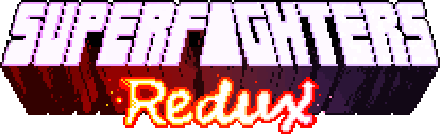
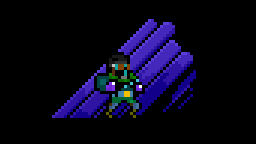
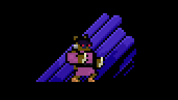
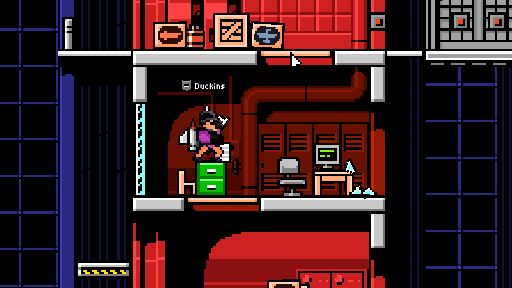
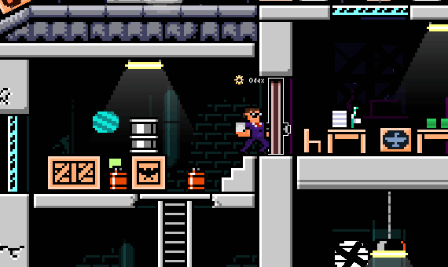

> [!CAUTION]
> This is an ***unofficial*** port of Superfighters Redux to Superfighters Deluxe `v.1.4.1b`.
> 
> The Superfighters Redux build used is the latest of SFR's repository, `v.1.0.5_dev`, and it is still in development. Due to both this, and the porting process you may experience crashes or unintended game behavior.
>
> Do ***not*** let this be your first experience of Superfighters Redux, I highly recommend playing the original build for SFD `v.1.3.7d`. You can get SFD `v.1.3.7d` through Steam betas.

> [!IMPORTANT]
> This mod is still a work-in-progress. Features may break, be added, removed, or changed entirely.

📖 FAQ

## About
**Superfighters Redux** is an open-source mod for [Superfighters Deluxe](https://mythologicinteractive.com/SuperfightersDeluxe). It adds new content and tweaks existing mechanics for a more engaging and dynamic game experience.

## Do you have the developers' consent?
Yes, we do. However, please read the full [license](https://github.com/Odex64/SFR/blob/master/LICENSE) for detailed clarification.

🚀 Features

## Skins
Explore a plethora of new items and colors you can equip. Some skins even feature a tertiary color option.

## Weapons
Discover tons of new weapons and makeshift items, each with unique mechanics and effects.

## Tiles
Unleash your creativity with a vast collection of new tiles and colors, perfect for custom level design.

## Much More
Enjoy new music, sounds, triggers, gore effects, increased slots, special items, and various other enhancements.

⚙️ Installation

## Download
You can download the latest version of Superfighters Redux [here](https://github.com/Odex64/SFR/releases).

## Setup
1. Extract the downloaded archive into your `Superfighters Deluxe` folder. If you have a previous SFR installation, ensure it is deleted first.
2. Open Steam and change `Superfighters Deluxe` launch options to `cmd /k "%command%\..\SFR.exe"`.

✍️ Acknowledgement

## Special thanks
* To the developers of [Superfighters Deluxe](https://mythologicinteractive.com/SuperfightersDeluxe).
* [Argón](https://github.com/TheOriginalArgon) (Coder).
* Motto73 (Coder).
* [Near Huscarl](https://github.com/NearHuscarl) (Items editor).
* Shock (Artist).
* Dxse (Artist).
* KLI (Artist).
* Casey (Artist).
* Danila015 (Artist).
* Eiga (Balancement, Organizer).
* Samwow (Composer).
* Mimyuu (Special fonts).
* Heapons (Moderator, Tester).
* Olv (Moderator, Tester).
* GoreDemon (Tester).
* Pricey (Tester).
* Emmet Brown (Tester).
* Dark (Tester).
* Everyone else who contributed.

## Forks
* [SFDCT](https://github.com/Liokindy/SFDCT) - A mod compatible with vanilla clients with some QoL enhancements.

